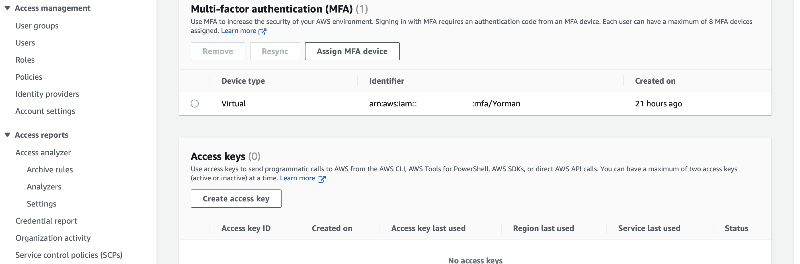
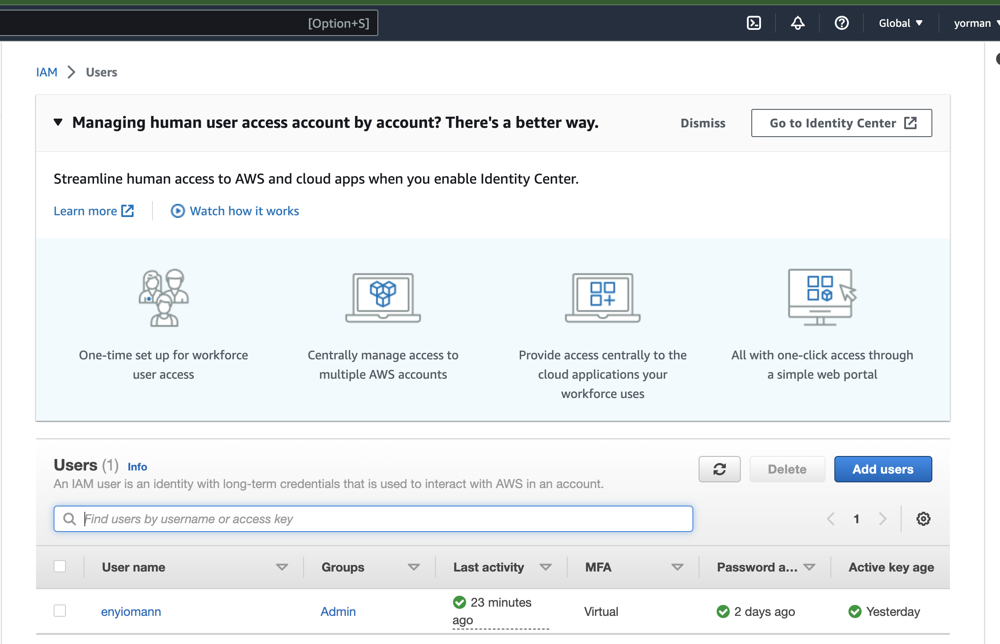
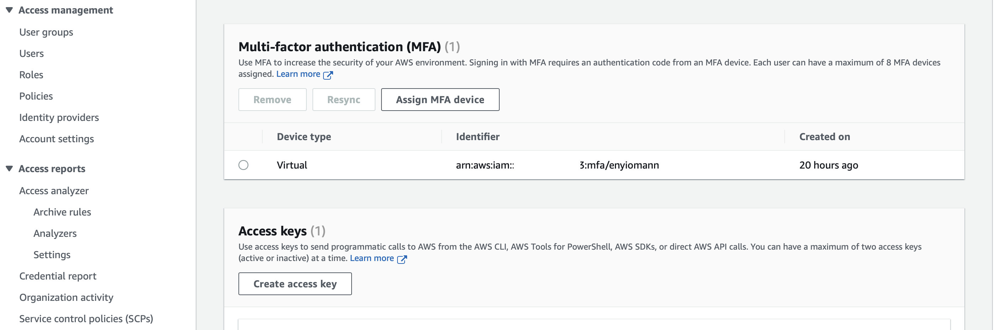
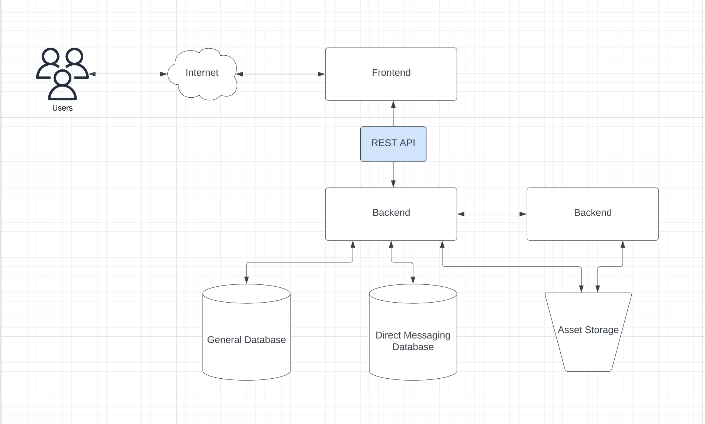
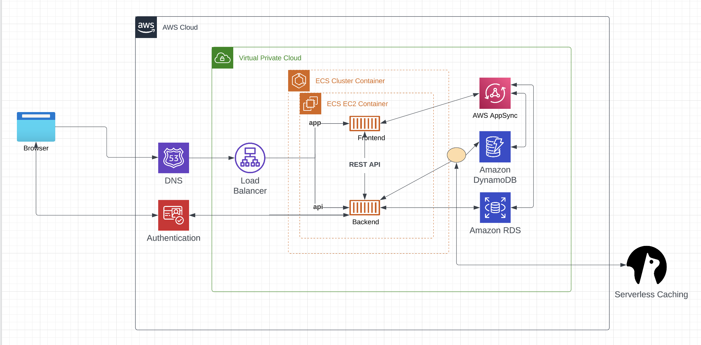

# Week 0 — Billing, Security, and Architecture

## Setup

Welcome to my first journal for the AWS Cloud Project Free Bootcamp organized by Andrew Brown and his team. 

For the bootcamp, participants were meant to setup some environments being tools for the projects.

Some of them include: 

- Create GitHub Account
- Create Gitpod Account
- Create Github CodeSpace
- Create AWS Account
- Create Lucidchart Account
- Create Honeycomb.io Account
- Create Rollbar Account

In order to secure the Cloud Infrastructure, monitor cost and adhere to best practises, the following actions were taken.

1. Multi-Factor Authentication (MFA) was enabled on the root user. 

For the reason of security and best practices, the root user should not be used for daily activities. Therefore, I created an IAM user, created a group with `Admin` permissions and added the user to the group.

To secure this user, MFA was also enabled on it.

## App Architecture

Lucidchart was used to illutrate the app conceptual, logical and infrastructural architecture. This is the [link](https://lucid.app/lucidchart/b20676bd-89b1-4ffa-a341-c9c269aef784/edit?viewport_loc=144%2C139%2C1579%2C867%2CZ2-xDaLVWdz9&invitationId=inv_06ff5e3b-1720-45a5-9413-434b1c83bff2) to the architecture.