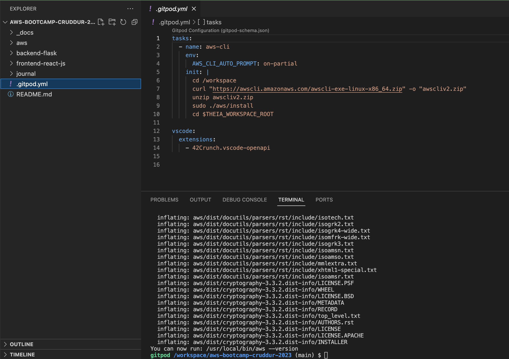

# Week 0 — Billing, Security, and Architecture

Welcome to my first journal for the AWS Cloud Project Free Bootcamp organized by Andrew Brown and his team. Thank you guys!

## App Architecture


Lucidchart was used to illutrate the app conceptual, logical and infrastructural architecture. This is the [link](https://lucid.app/lucidchart/b20676bd-89b1-4ffa-a341-c9c269aef784/edit?viewport_loc=144%2C139%2C1579%2C867%2CZ2-xDaLVWdz9&invitationId=inv_06ff5e3b-1720-45a5-9413-434b1c83bff2) to the architecture. The challenge I had here was having limited number of icons I could use due to my free-tier account. I was able to streamline the architecture to arrive at something meaningful but minimal at the same time.
## Setup

For the bootcamp, participants were meant to setup some environments being tools for the projects.

Some of them include: 

- Create GitHub Account
- Create Gitpod Account
- Create Github CodeSpace
- Create AWS Account
- Create Lucidchart Account
- Create Honeycomb.io Account
- Create Rollbar Account

In order to secure the Cloud Infrastructure, monitor cost and adhere to best practises, the following actions were taken.

1. Multi-Factor Authentication (MFA) was enabled on the root user. This is to increase the security of user accounts by adding an extra layer of protection against unauthorized access. 


For the reason of security and best practices, the root user should not be used for daily activities. Therefore, I created an IAM user, created a group, `Admin`, with `AdministratorAccess` permissions and added the user to the group.


To secure this user, MFA was also enabled on it. I also created and downloaded the CSV file with the user's `Access Key` and `Secret Access Key`.


2. I installed AWS CLI manually on Gitpod. Then modified the `.gitpod.yml` file with the following code so that AWS CLI automatically installs whenever Gitpod workspace is launched.

```
tasks:
  - name: aws-cli
    env:
      AWS_CLI_AUTO_PROMPT: on-partial
    init: |
      cd /workspace
      curl "https://awscli.amazonaws.com/awscli-exe-linux-x86_64.zip" -o "awscliv2.zip"
      unzip awscliv2.zip
      sudo ./aws/install
      cd $THEIA_WORKSPACE_ROOT
```



3. The AWS User credentials were set as environmental variables on the Gitpod bash with the following commands:

```
export AWS_ACCESS_KEY_ID=""
export AWS_SECRET_ACCESS_KEY=""
export AWS_DEFAULT_REGION=us-east-1
```
The variables were then subsisted with the following commands so that Gitpod 'remembers' them at relaunch.

```
gp env AWS_ACCESS_KEY_ID=""
gp env AWS_SECRET_ACCESS_KEY=""
gp env AWS_DEFAULT_REGION=us-east-1
```


