# Week 1 — App Containerization

First run the backend Flask app locally to make sure it also runs when containerized.

For the Cruddur backend to run, some environmental variables should be declared.

```
export FRONTEND_URL="*"
export BACKEND_URL="*"
```

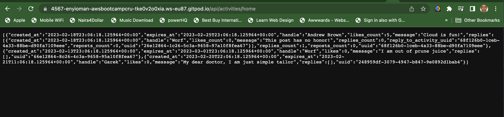

Next, we'll proceed with containerizing the backend. But first the environmental variables need to be unset.

```
unset FRONTEND_URL
unset BACKEND_URL
```
## Containerize Application (Dockerfiles, Docker Compose)

Create a `Dockerfile` in the backend directory. This gives Docker the set of instructions and steps required in containerizing the application. Below is the content of the Dockerfile.

```
FROM python:3.10-slim-buster

WORKDIR /backend-flask

COPY requirements.txt requirements.txt
RUN pip3 install -r requirements.txt

COPY . .

ENV FLASK_ENV=development

EXPOSE ${PORT}
CMD [ "python3", "-m" , "flask", "run", "--host=0.0.0.0", "--port=4567"]
```


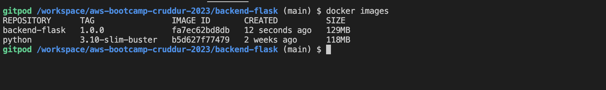


Run the container afterwards for the backend app.

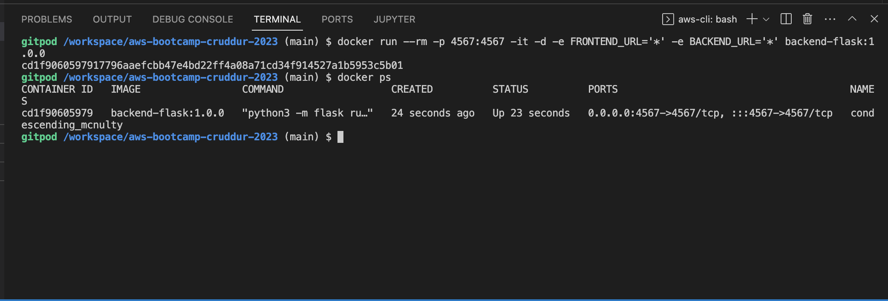

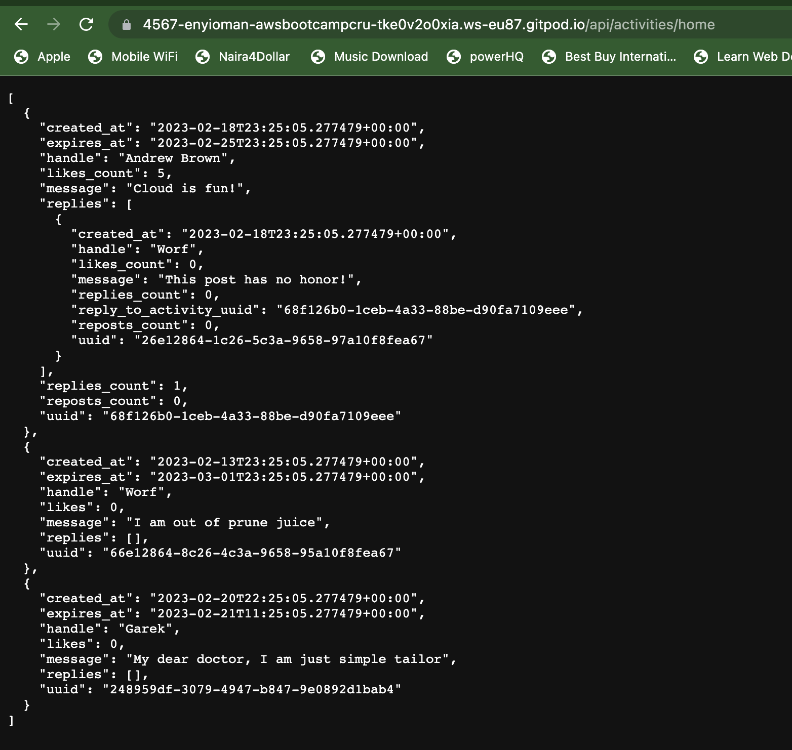

That's awesome. Now we move on to the frontend of the application and basically run through the same process.

We first run the app locally and then proceed to containerizing it with the following `Dockerfile` script.

```
FROM node:16.18

ENV PORT=3000

COPY . /frontend-react-js
WORKDIR /frontend-react-js
RUN npm install
EXPOSE ${PORT}
CMD ["npm", "start"]
```

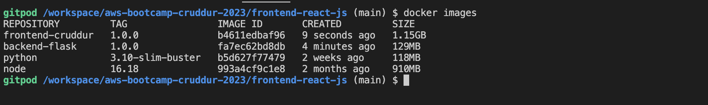

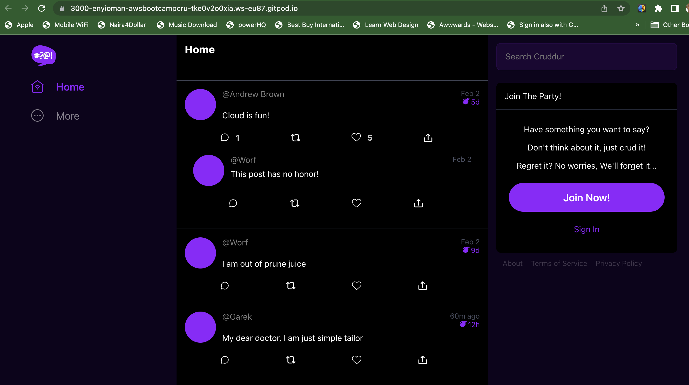

## Document the Notification Endpoint for the OpenAI Document

We'll use `/api/activities/notifications` as the notifications endpoint and then add it to `/backend-flask/openapi-3.0.yml`: [commit](https://github.com/enyioman/aws-bootcamp-cruddur-2023/commit/069ffd47e6cbc106bea74ed8e597205bf5440e37)

```
/api/activities/notifications:
    get:
      description: 'Return a feed of activities for all notifications'
      tags:
       - activities
      parameters: []
      responses:
        '200':
          description: Returns an array of activities
          content:
            application/json:
              schema:
                type: array
                items:
                  $ref: '#/components/schemas/Activity'
```

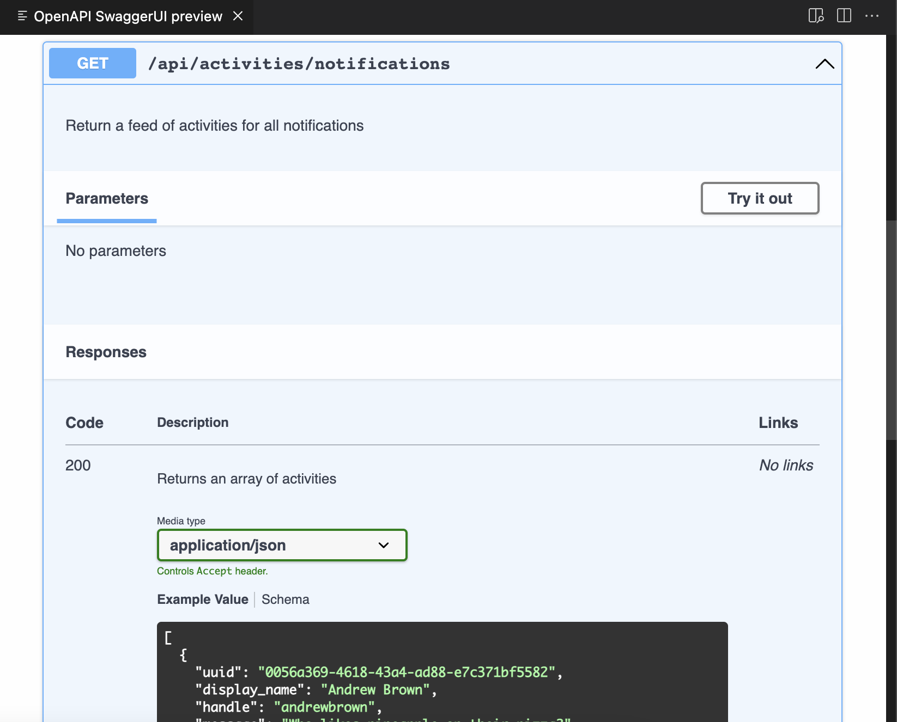
## Write a Flask Backend Endpoint for Notifications.

Create the service and route for the backend notification feature. 

`backend-flask/app.py`
```
import os

from services.home_activities import *
from services.notifications_activities import *
from services.user_activities import *
from services.create_activity import *
from services.create_reply import *
@@ -65,6 +66,11 @@ def data_home():
  data = HomeActivities.run()
  return data, 200

@app.route("/api/activities/notifications", methods=['GET'])
def data_notifications():
  data = NotificationsActivities.run()
  return data, 200

@app.route("/api/activities/@<string:handle>", methods=['GET'])
def data_handle(handle):
  model = UserActivities.run(handle)
```

`backend-flask/services/notifications_activities.py`
```
from datetime import datetime, timedelta, timezone
class NotificationsActivities:
  def run():
    now = datetime.now(timezone.utc).astimezone()
    results = [{
      'uuid': '68f126b0-1ceb-4a33-88be-d90fa7109eee',
      'handle':  'Enyioma Nwadibia',
      'message': 'Cloud is fun!',
      'created_at': (now - timedelta(days=2)).isoformat(),
      'expires_at': (now + timedelta(days=5)).isoformat(),
      'likes_count': 5,
      'replies_count': 1,
      'reposts_count': 0,
      'replies': [{
        'uuid': '26e12864-1c26-5c3a-9658-97a10f8fea67',
        'reply_to_activity_uuid': '68f126b0-1ceb-4a33-88be-d90fa7109eee',
        'handle':  'Worf',
        'message': 'This post has no honor!',
        'likes_count': 0,
        'replies_count': 0,
        'reposts_count': 0,
        'created_at': (now - timedelta(days=2)).isoformat()
      }],
    },
    ]
    return results
```

Here's the [commit](https://github.com/enyioman/aws-bootcamp-cruddur-2023/commit/3174743e60939045e1ba06aa20adef452889eb0c).

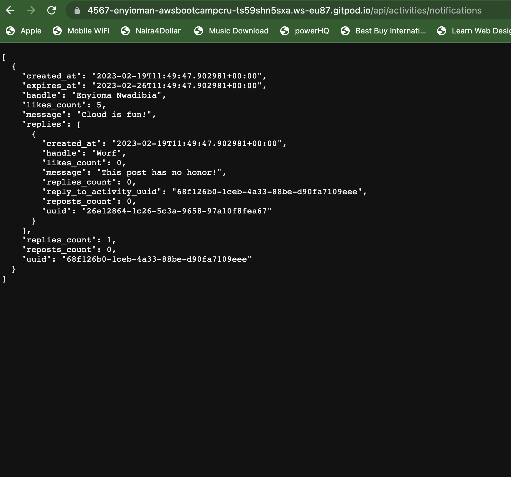

## Write a React Page for Notifications

Created the notification page and route for the frontend app also.

The **commit** can be found [here](https://github.com/enyioman/aws-bootcamp-cruddur-2023/commit/bfd4d3afdef51f99563642cf67ca8c182c5b6e51). 

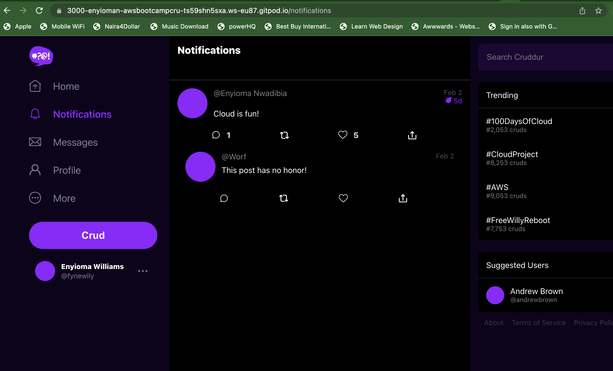

## Run PostgreSQL and DynamoDB Local Container.

Note that I had to stop running the backend container before I could run the frontend. To run and orchestrate multiple containers, Docker Compose comes to the rescue.

We'll use Docker compose to run the frontend, backend, DynamoDB, and Postgresql databases. To achieve this, create a file, `docker-compose.yml` in the root directory. The content of the file can be found [here](https://github.com/enyioman/aws-bootcamp-cruddur-2023/blob/main/docker-compose.yml).

Run the command to build the images and run the containers if there are no errors in the YAML file.

```
docker-compose up --build
```

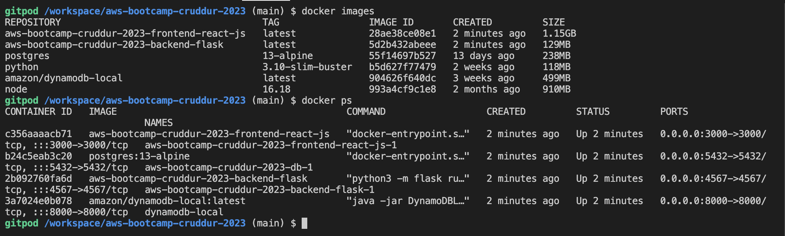

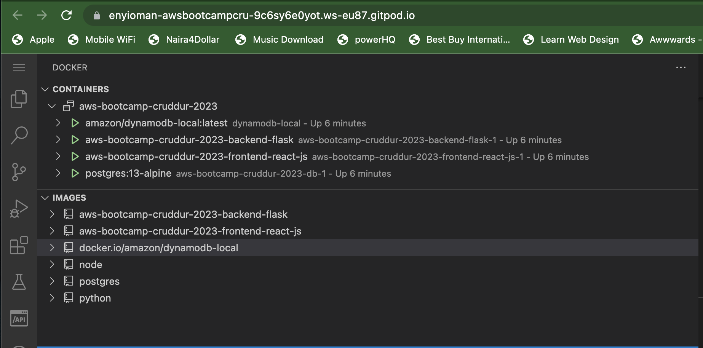

## Validating the DynamoDB and Postgresql Databases 

To validate access to the databases, we'll create table, put items into them and then query the items.

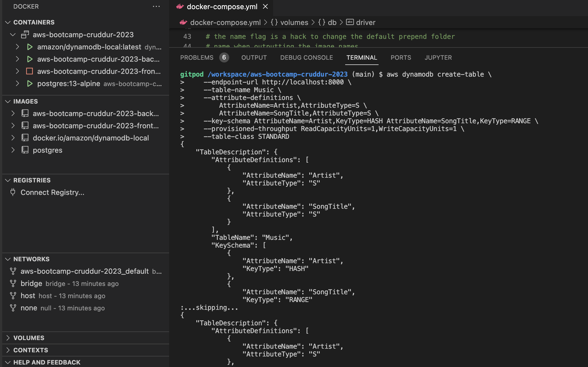

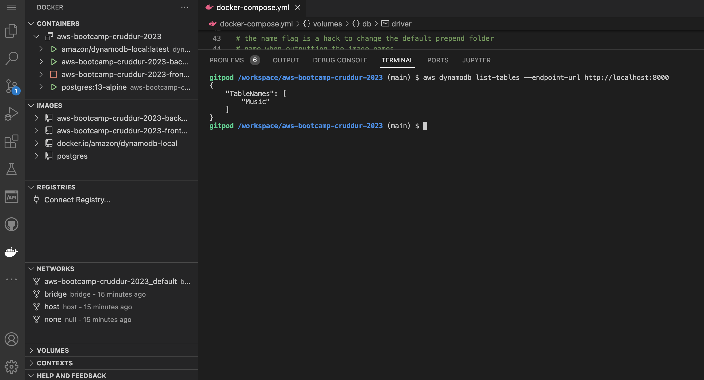

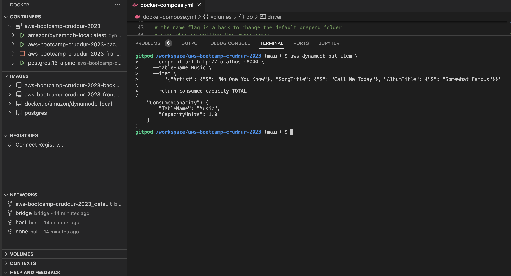

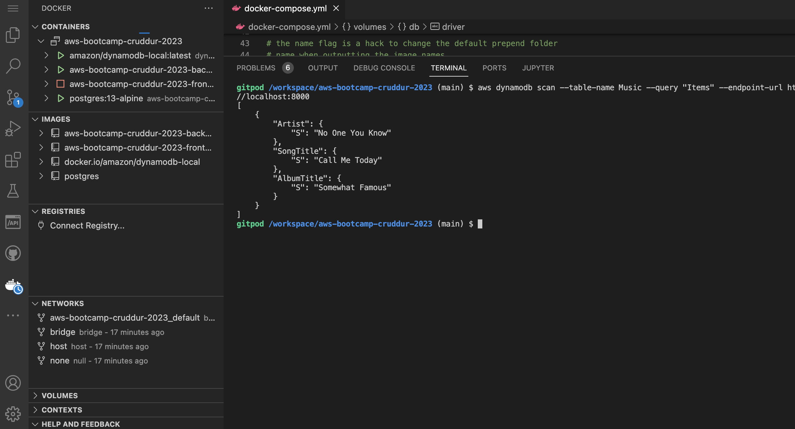

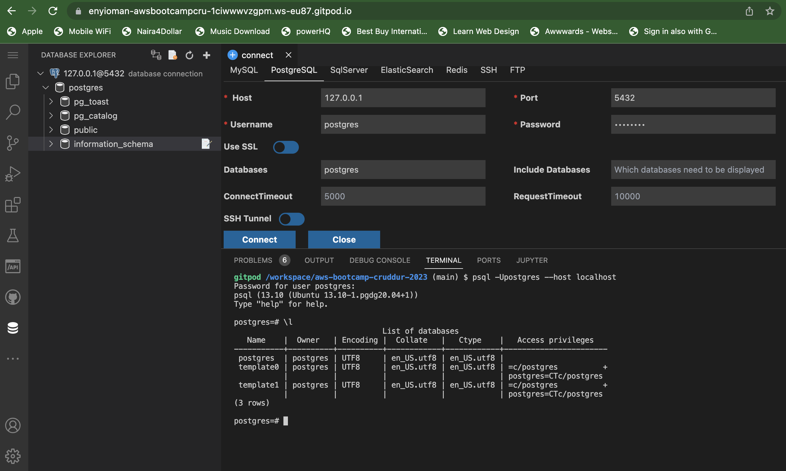


# Homework Challenges

