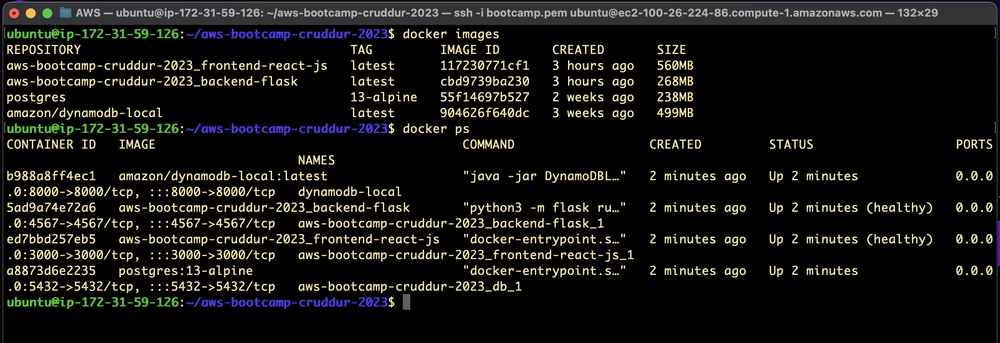

# Week 1 — App Containerization

First run the backend Flask app locally to make sure it also runs when containerized.

For the Cruddur backend to run, some environmental variables should be declared.

```
export FRONTEND_URL="*"
export BACKEND_URL="*"
```


Next, we'll proceed with containerizing the backend. But first the environmental variables need to be unset.

```
unset FRONTEND_URL
unset BACKEND_URL
```
## Containerize Application (Dockerfiles, Docker Compose)

Create a `Dockerfile` in the backend directory. This gives Docker the set of instructions and steps required in containerizing the application. Below is the content of the Dockerfile.

```
FROM python:3.10-slim-buster

WORKDIR /backend-flask

COPY requirements.txt requirements.txt
RUN pip3 install -r requirements.txt

COPY . .

ENV FLASK_ENV=development

EXPOSE ${PORT}
CMD [ "python3", "-m" , "flask", "run", "--host=0.0.0.0", "--port=4567"]
```


Run the container afterwards for the backend app.


That's awesome. Now we move on to the frontend of the application and basically run through the same process.

We first run the app locally and then proceed to containerizing it with the following `Dockerfile` script.

```
FROM node:16.18

ENV PORT=3000

COPY . /frontend-react-js
WORKDIR /frontend-react-js
RUN npm install
EXPOSE ${PORT}
CMD ["npm", "start"]
```


## Create a docker-compose file to run multiple containers


Note that I had to stop running the backend container before I could run the frontend. To run and orchestrate multiple containers, Docker Compose comes to the rescue.

Create a file `docker-compose.yml` in the root directory (/aws-bootcamp-cruddur-2023/docker-compose.yml):

```
version: "3.8"
services:
  backend-flask:
    environment:
      FRONTEND_URL: "https://3000-${GITPOD_WORKSPACE_ID}.${GITPOD_WORKSPACE_CLUSTER_HOST}"
      BACKEND_URL: "https://4567-${GITPOD_WORKSPACE_ID}.${GITPOD_WORKSPACE_CLUSTER_HOST}"
    build: ./backend-flask
    ports:
      - "4567:4567"
    volumes:
      - ./backend-flask:/backend-flask
  frontend-react-js:
    environment:
      REACT_APP_BACKEND_URL: "https://4567-${GITPOD_WORKSPACE_ID}.${GITPOD_WORKSPACE_CLUSTER_HOST}"
    build: ./frontend-react-js
    ports:
      - "3000:3000"
    volumes:
      - ./frontend-react-js:/frontend-react-js

# the name flag is a hack to change the default prepend folder
# name when outputting the image names
networks: 
  internal-network:
    driver: bridge
    name: cruddur
```
## Container Security Considerations

The frontend and backend of the app was analyzed with Snyk which pointed out some critical vulnerabilities in the Dockerfile. With the help of the tool a pull request was created to fix the vulnerabilities. [frontend commit](https://github.com/enyioman/aws-bootcamp-cruddur-2023/commit/cbf25c3fa732bdd00999086bb54acdcfad8ea7ea)

The below screenshots depict the status of the app before and after the fix.


[**backend commit**](https://github.com/enyioman/aws-bootcamp-cruddur-2023/commit/c8ba585b7ad4bac05b8049430a5a044c704df131)


## Document the Notification Endpoint for the OpenAI Document

We'll use `/api/activities/notifications` as the notifications endpoint and then add it to `/backend-flask/openapi-3.0.yml`: [commit](https://github.com/enyioman/aws-bootcamp-cruddur-2023/commit/069ffd47e6cbc106bea74ed8e597205bf5440e37)

```
/api/activities/notifications:
    get:
      description: 'Return a feed of activities for all notifications'
      tags:
       - activities
      parameters: []
      responses:
        '200':
          description: Returns an array of activities
          content:
            application/json:
              schema:
                type: array
                items:
                  $ref: '#/components/schemas/Activity'
```


## Write a Flask Backend Endpoint for Notifications.

Create the service and route for the backend notification feature. 

`backend-flask/app.py`
```
import os

from services.home_activities import *
from services.notifications_activities import *
from services.user_activities import *
from services.create_activity import *
from services.create_reply import *
@@ -65,6 +66,11 @@ def data_home():
  data = HomeActivities.run()
  return data, 200

@app.route("/api/activities/notifications", methods=['GET'])
def data_notifications():
  data = NotificationsActivities.run()
  return data, 200

@app.route("/api/activities/@<string:handle>", methods=['GET'])
def data_handle(handle):
  model = UserActivities.run(handle)
```

`backend-flask/services/notifications_activities.py`
```
from datetime import datetime, timedelta, timezone
class NotificationsActivities:
  def run():
    now = datetime.now(timezone.utc).astimezone()
    results = [{
      'uuid': '68f126b0-1ceb-4a33-88be-d90fa7109eee',
      'handle':  'Enyioma Nwadibia',
      'message': 'Cloud is fun!',
      'created_at': (now - timedelta(days=2)).isoformat(),
      'expires_at': (now + timedelta(days=5)).isoformat(),
      'likes_count': 5,
      'replies_count': 1,
      'reposts_count': 0,
      'replies': [{
        'uuid': '26e12864-1c26-5c3a-9658-97a10f8fea67',
        'reply_to_activity_uuid': '68f126b0-1ceb-4a33-88be-d90fa7109eee',
        'handle':  'Worf',
        'message': 'This post has no honor!',
        'likes_count': 0,
        'replies_count': 0,
        'reposts_count': 0,
        'created_at': (now - timedelta(days=2)).isoformat()
      }],
    },
    ]
    return results
```

Here's the [commit](https://github.com/enyioman/aws-bootcamp-cruddur-2023/commit/3174743e60939045e1ba06aa20adef452889eb0c).


## Write a React Page for Notifications

Created the notification page and route for the frontend app also.

The **commit** can be found [here](https://github.com/enyioman/aws-bootcamp-cruddur-2023/commit/bfd4d3afdef51f99563642cf67ca8c182c5b6e51). 


## Run PostgreSQL and DynamoDB Local Container.

We'll use Docker compose to run the frontend, backend, DynamoDB, and Postgresql databases. To achieve this, create a file, `docker-compose.yml` in the root directory. The content of the file can be found [here](https://github.com/enyioman/aws-bootcamp-cruddur-2023/blob/main/docker-compose.yml).

Run the command to build the images and run the containers if there are no errors in the YAML file.

```
docker-compose up --build
```


## Validating the DynamoDB and Postgresql Databases 

To validate access to the databases, we'll create table, put items into them and then query the items.


# Homework Challenges

## Run the dockerfile CMD as an external script

For the backend app, we first create a file `backend-flask/backend.sh` and add the below scripts to it: [commit](https://github.com/enyioman/aws-bootcamp-cruddur-2023/commit/32061e11f50faa7c9ef04f695e7c35b99a1fd2b7)

```
#!/bin/sh
python3 -m flask run --host=0.0.0.0 --port=4567
```

Then modify the backend Dockerfile to the below:

```
FROM python:3.10-slim-buster 

WORKDIR /backend-flask

COPY requirements.txt requirements.txt
RUN pip3 install -r requirements.txt

COPY . .

ENV FLASK_ENV=developent

EXPOSE ${PORT}
#python3 -m flask run --host=.0.0.0.0 --port=4567
#CMD ["python3", "-m", "flask", "run", "--host=0.0.0.0", "--port=4567"]
RUN chmod +x backend.sh
RUN ./backend.sh
```

Then do same for the frontend: [commit](https://github.com/enyioman/aws-bootcamp-cruddur-2023/commit/024899bbecdd720cecdb883156bf5fbde7c9fbdc)

`frontend.sh`

```
#!/bin/sh
npm start
```

`frontend-react/Dockerfile`

```
FROM node:16.18 

WORKDIR /frontend-react-js

ENV PORT=3000

COPY . /frontend-react-js

RUN npm install
EXPOSE ${PORT}

#CMD ["npm", "start"]
RUN chmod +x frontend.sh
RUN ./frontend.sh
```

## Use multi-stage building for a Dockerfile build

A multi-stage Docker build is a Dockerfile construct that allows you to create an optimized Docker image with a small footprint by leveraging multiple stages in the build process.

The idea behind a multi-stage build is to have multiple stages or phases in your Dockerfile, where each stage is responsible for a different aspect of the build process. Each stage can have its own set of instructions, dependencies, and tools.

This strategy in addition to changing the base image reduced the frontend image size from 1.15GB to 24.4MB.
### Frontend

We'll update the frontend Dockerfile to the following: ([commit](https://github.com/enyioman/aws-bootcamp-cruddur-2023/commit/75eb038e25f0274788727874800fba0b81b711a8))

```
FROM node:16.19-slim AS appbuild

ENV PORT=3000
ENV NODE_ENV=production

RUN apt-get update 
RUN apt-get install -y gcc
RUN apt-get install -y curl

COPY . /frontend-react-js
WORKDIR /frontend-react-js
EXPOSE ${PORT}
RUN npm ci --production && npm run build

FROM nginx:1.21.0-alpine as production

COPY --from=appbuild /frontend-react-js/build /usr/share/nginx/html

RUN mv /etc/nginx/conf.d/default.conf /etc/nginx/conf.d/confbackup.conf

COPY nginx/nginx.conf /etc/nginx/conf.d

EXPOSE ${PORT}

CMD ["nginx", "-g", "daemon off;"] 
```

Then serve the frontend using Nginx. Create a file `frontend-react/nginx/nginx.conf` with the below script:

```
server {

  listen 3000 default_server;

  location / {
    root /usr/share/nginx/html/;
    index index.html index.htm;
    try_files $uri $uri/ /index.html;
  }
  error_page    500 502 503 504   /50x.html;

  location = /50x.html {
    root  /user/share/nginx/html;
  }
}
```


## Push and tag an image to DockerHub

Built images can be stored in repositories like Dockerhub for ease of sharing, collaboration, version control, ease of deployment, and/or automatic builds. We'll push our image to Dockerhub using the following steps:

Login to Dockerhub


Tag the image with the below command:
```
docker tag cruddur-frontend:1.0.0 fynewily/cruddur-frontend:1.0
```

Then push the image using:

```
docker push fynewily/cruddur-frontend:1.0
```


## Implement a healthcheck in the V3 Docker compose file

Updated the `docker-compose.yml` file and added healthchecks for both the frontend and backend endpoints.

`Backend`

```
backend-flask:
    environment:
      FRONTEND_URL: "https://3000-${GITPOD_WORKSPACE_ID}.${GITPOD_WORKSPACE_CLUSTER_HOST}"
      BACKEND_URL: "https://4567-${GITPOD_WORKSPACE_ID}.${GITPOD_WORKSPACE_CLUSTER_HOST}"
    build: ./backend-flask
    ports:
      - "4567:4567"
    healthcheck:
      test: ["CMD", "curl", "-f", "http://localhost:4567/api/activities/home"] 
      interval: 30s
      retries: 3
      start_period: 30s
      timeout: 20s
```

`Frontend`

```
frontend-react-js:
    environment:
      REACT_APP_BACKEND_URL: "https://4567-${GITPOD_WORKSPACE_ID}.${GITPOD_WORKSPACE_CLUSTER_HOST}"
    build: ./frontend-react-js
    ports:
      - "3000:3000"
    healthcheck:
      test: ["CMD", "curl", "-f", "http://localhost:3000/api/activities/home"] 
      interval: 30s
      retries: 3
      start_period: 30s
      timeout: 20s
```


After the healthcheck implementation, both endpoints were unhealthy. While troubleshooting, I found out I was not able to curl the endpoints from within and outside the container. The result of my research and collaborations showed that I needed to install curl into the container through the Dockerfile. The installation of curl solved the issue and the endpoints became healthy. [Installation commit](https://github.com/enyioman/aws-bootcamp-cruddur-2023/commit/29a050cc5bafbd790a2d87cc4ac736f3b25b4e95)


## Research best practices of Dockerfiles and attempt to implement it in your Dockerfile

One of the best practices of Dockerfiles is the use of `.dockerignore` files which is used to specify which files and directories should be excluded from the Docker build context when building a Docker image. This is used to reduce the image size or prevent the inclusion of sensitive information in the docker image.

`.dockerignore` files were created for both the frontend and backend application. [commit](https://github.com/enyioman/aws-bootcamp-cruddur-2023/commit/a50ac8378f420624e682ea5bfbf58837490d7de7)


## Learn how to install Docker on your localmachine and get the same containers running outside of Gitpod / Codespaces


## Launch an EC2 instance that has docker installed, and pull a container to demonstrate you can run your own docker processes. 

Spinned up an EC2 with Ubuntu 20.04 on AWS and installed NodeJs, Flask, Docker and Docker Compose with the following commands:

```
apt update -y
apt upgrade -y
curl -fsSL https://deb.nodesource.com/setup_18.x | sudo -E bash -
apt-get install -y nodejs
apt install -y python3-pip
apt install -y software-properties-common
apt install -y python3-virtualenv
apt install -y apt-transport-https ca-certificates curl software-properties-common
curl -fsSL https://download.docker.com/linux/ubuntu/gpg | sudo apt-key add -
add-apt-repository 'deb [arch=amd64] https://download.docker.com/linux/ubuntu focal stable'
apt-cache policy docker-ce
apt install -y docker-ce
curl -L 'https://github.com/docker/compose/releases/download/1.29.2/docker-compose-$(uname -s)-$(uname -m)' -o /usr/local/bin/docker-compose
chmod +x /usr/local/bin/docker-compose
```


Cloned the Cruddur application and got it running on the EC2.


