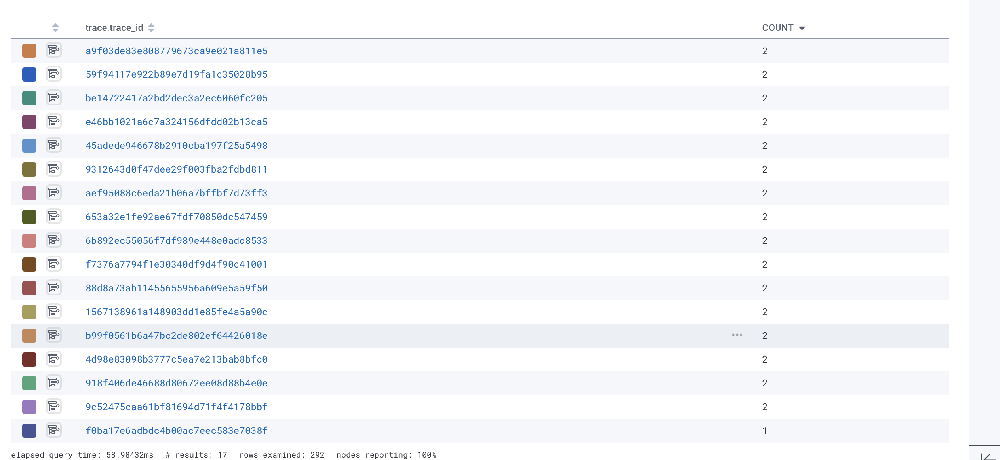
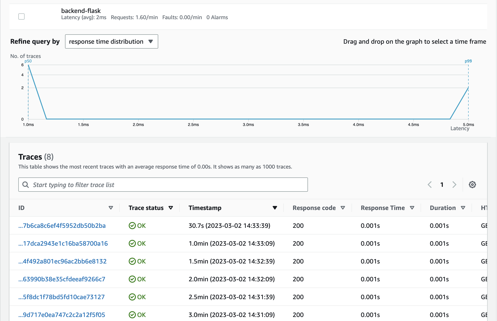

# Week 2 — Distributed Tracing

- [x] [Go to Homework Challenge](#Homework-Challenge)


This week we are working on distributed tracing for our Cruddur app. 

Distributed tracing is a technique used to monitor and profile applications that are distributed across multiple services, processes, and systems. It provides a way to understand the flow of requests through a distributed system and helps to identify and diagnose performance issues.

In a distributed tracing system, each request is assigned a unique identifier, or trace ID, which is propagated across all the services involved in processing that request. As the request flows through the system, each service logs timing and metadata information about its handling of the request, including the time it takes to process the request and any errors encountered.

This trace information is then collected and correlated across all the services involved in processing the request, allowing developers and operations teams to visualize the end-to-end request flow and identify bottlenecks, errors, and other issues. Distributed tracing can be used to optimize system performance, diagnose problems, and improve the reliability and availability of distributed applications.

## Instrument our backend flask application to use Open Telemetry (OTEL) with Honeycomb.io as the provider 

**COMMITS:** [DEPENDENCIES](https://github.com/enyioman/aws-bootcamp-cruddur-2023/commit/67f8eef75489d4f1f7a924390876fe710e5ce0b1)
[INSTRUMENTATION](https://github.com/enyioman/aws-bootcamp-cruddur-2023/commit/1a0337501ee28d119d206c9e4365b428deb49566) [SPANS](https://github.com/enyioman/aws-bootcamp-cruddur-2023/commit/e9f1502c852ba48eb3d4657d5525bd9db239202a) [MOCK TRACES](https://github.com/enyioman/aws-bootcamp-cruddur-2023/commit/3e137e66456ccf6f15a802a4a4797fccb39e9280)

We'll add the required Python OTEL dependencies in our `requirement.txt` file.

```
opentelemetry-api 
opentelemetry-sdk 
opentelemetry-exporter-otlp-proto-http 
opentelemetry-instrumentation-flask 
opentelemetry-instrumentation-requests
```

And run the following command afterwards to install them:

```
pip install -r requirements.txt
```

Then add the following to `app.py`

```
from opentelemetry import trace
from opentelemetry.instrumentation.flask import FlaskInstrumentor
from opentelemetry.instrumentation.requests import RequestsInstrumentor
from opentelemetry.exporter.otlp.proto.http.trace_exporter import OTLPSpanExporter
from opentelemetry.sdk.trace import TracerProvider
from opentelemetry.sdk.trace.export import BatchSpanProcessor
```

```
# Initialize tracing and an exporter that can send data to Honeycomb
provider = TracerProvider()
processor = BatchSpanProcessor(OTLPSpanExporter())
provider.add_span_processor(processor)
trace.set_tracer_provider(provider)
tracer = trace.get_tracer(__name__)
```

```
# Initialize automatic instrumentation with Flask
app = Flask(__name__)
FlaskInstrumentor().instrument_app(app)
RequestsInstrumentor().instrument()
```

Then we add the following environmental variables to `backend-flask` in our `docker-compose.yml` file:

```
OTEL_SERVICE_NAME: "backend-flask"
OTEL_EXPORTER_OTLP_ENDPOINT: "https://api.honeycomb.io"
OTEL_EXPORTER_OTLP_HEADERS: "x-honeycomb-team=${HONEYCOMB_API_KEY}"
```

Docker compose up and hit the endpoint





## Instrument AWS X-Ray into backend flask application 
[**Commit**](https://github.com/enyioman/aws-bootcamp-cruddur-2023/commit/2a87984cc1cc069c30662a279c3a8115782ef2d2)

We'll first add AWS SDK as one of our dependencies in `requirement.txt`

```
aws-xray-sdk
```

Then install the depency with 

```
pip install -r requirements.txt
```

Add the following to `app.py`:

```
from aws_xray_sdk.core import xray_recorder
from aws_xray_sdk.ext.flask.middleware import XRayMiddleware

xray_url = os.getenv("AWS_XRAY_URL")
xray_recorder.configure(service='backend-flask', dynamic_naming=xray_url)
XRayMiddleware(app, xray_recorder)
```


We'll set up Sampling rules by creating the file `aws/json/xray.json`:

```
{
  "SamplingRule": {
      "RuleName": "Cruddur",
      "ResourceARN": "*",
      "Priority": 9000,
      "FixedRate": 0.1,
      "ReservoirSize": 5,
      "ServiceName": "Cruddur",
      "ServiceType": "*",
      "Host": "*",
      "HTTPMethod": "*",
      "URLPath": "*",
      "Version": 1
  }
}
```

Next, we run the followimg command:

```
aws xray create-group \
   --group-name "Cruddur" \
   --filter-expression "service(\"backend-flask\")"
```


Head over to AWS Console for validation.


Now is the time we create the Sampling Rules. In AWS X-Ray, sampling rules are used to determine which requests should be traced and sent to X-Ray for analysis.

When X-Ray receives a request, it applies a sampling rule to determine whether or not to trace that request. Sampling helps reduce the amount of data that X-Ray processes and stores, which can be especially important in high-volume environments where tracing every request would be too expensive.

Run the following command to create one:

```
aws xray create-sampling-rule --cli-input-json file://aws/json/xray.json
```


Next, we'll run the X-ray daemon as a container. Add the following to `docker-compose.yml` file:

```
  xray-daemon:
    image: "amazon/aws-xray-daemon"
    environment:
      AWS_ACCESS_KEY_ID: "${AWS_ACCESS_KEY_ID}"
      AWS_SECRET_ACCESS_KEY: "${AWS_SECRET_ACCESS_KEY}"
      AWS_REGION: "us-east-1"
    command:
      - "xray -o -b xray-daemon:2000"
    ports:
      - 2000:2000/udp
```

We'll also need to add the following environmental variables to our `docker-compose.yml` file:

```
AWS_XRAY_URL: "*4567-${GITPOD_WORKSPACE_ID}.${GITPOD_WORKSPACE_CLUSTER_HOST}*"
AWS_XRAY_DAEMON_ADDRESS: "xray-daemon:2000"
```




## Install WatchTower and write a custom logger to send application log data to - CloudWatch Log group 

[**Commit**](https://github.com/enyioman/aws-bootcamp-cruddur-2023/commit/2909d636bf7ce681f176f8bc4c72ed0eeac99169)


We'll add the required dependency to `requirements.txt` and  install it:

```
watchtower
```
```
pip install -r requirements.txt
```

Then add the following to `app.py`:

```
import watchtower
import logging
from time import strftime
```

```
# Configuring Logger to Use CloudWatch
LOGGER = logging.getLogger(__name__)
LOGGER.setLevel(logging.DEBUG)
console_handler = logging.StreamHandler()
cw_handler = watchtower.CloudWatchLogHandler(log_group='cruddur')
LOGGER.addHandler(console_handler)
LOGGER.addHandler(cw_handler)
LOGGER.info("test_log")
```

```
@app.after_request
def after_request(response):
    timestamp = strftime('[%Y-%b-%d %H:%M]')
    LOGGER.error('%s %s %s %s %s %s', timestamp, request.remote_addr, request.method, request.scheme, request.full_path, response.status)
    return response
```

Add the following environmental variables to our `docker-compose.yml` file:

```
AWS_DEFAULT_REGION: "${AWS_DEFAULT_REGION}"
AWS_ACCESS_KEY_ID: "${AWS_ACCESS_KEY_ID}"
AWS_SECRET_ACCESS_KEY: "${AWS_SECRET_ACCESS_KEY}"
```


We hit our backend endpoint a few times then navigate to cloudwatch in AWS Console.


## Integrate Rollbar for Error Logging 

**Commits** [ONE](https://github.com/enyioman/aws-bootcamp-cruddur-2023/commit/247c360b73ecd1be0d9f2c3447b058098d362c76) [TWO](https://github.com/enyioman/aws-bootcamp-cruddur-2023/commit/2653cdd84205c9771a09adf46c19f80171f88185)


We'll add the required dependency to `requirements.txt` and  install it:

```
blinker
rollbar
```

```
pip install -r requirements.txt
```

We'll add and persist Rollbar Access Token on Gitpod:

```
export ROLLBAR_ACCESS_TOKEN=""
gp env ROLLBAR_ACCESS_TOKEN=""
```

Also add it to `docker-compose.yml`:

```
ROLLBAR_ACCESS_TOKEN: "${ROLLBAR_ACCESS_TOKEN}"
```

The following goes into `app.py`:

```
import rollbar
import rollbar.contrib.flask
from flask import got_request_exception
```

```
rollbar_access_token = os.getenv('ROLLBAR_ACCESS_TOKEN')
@app.before_first_request
def init_rollbar():
    """init rollbar module"""
    rollbar.init(
        # access token
        rollbar_access_token,
        # environment name
        'production',
        # server root directory, makes tracebacks prettier
        root=os.path.dirname(os.path.realpath(__file__)),
        # flask already sets up logging
        allow_logging_basic_config=False)

    # send exceptions from `app` to rollbar, using flask's signal system.
    got_request_exception.connect(rollbar.contrib.flask.report_exception, app)
```

Then add a test api also into `app.py`:

```
@app.route('/rollbar/test')
def rollbar_test():
    rollbar.report_message('Hello World!', 'warning')
    return "Hello World!"
```

Hit the test endpoint a few points and head over to Rollbar Console.


## Trigger an error an observe an error with Rollbar

We deliberately trigger an error by alterating some code then hit the endpoints again.


# Homework Challenge 

## Adding a custom span with a User ID

[Commit](https://github.com/enyioman/aws-bootcamp-cruddur-2023/commit/3a064945d70db00c0291434015b4f559aa67cc3d)


Added Userid attribute