# Week 3 — Decentralized Authentication

Decentralized authentication is a type of authentication system that relies on a decentralized network rather than a centralized authority to verify the identity of users. In a decentralized authentication system, users' identity information is stored and verified across a network of nodes, each of which can confirm the identity of a user independently.

One key advantage of decentralized authentication is that it can enable users to maintain greater control over their personal data, since their identity information is not being stored in a central repository. This can help to reduce the risk of data breaches and other types of cyber threats. Additionally, decentralized authentication can be more scalable and resilient than centralized systems, since it doesn't rely on a single point of failure.


## Install and configure Amplify client-side library for Amazon Congito


Firstly, we'll head over to AWS Console to provision Cognito User Group. 

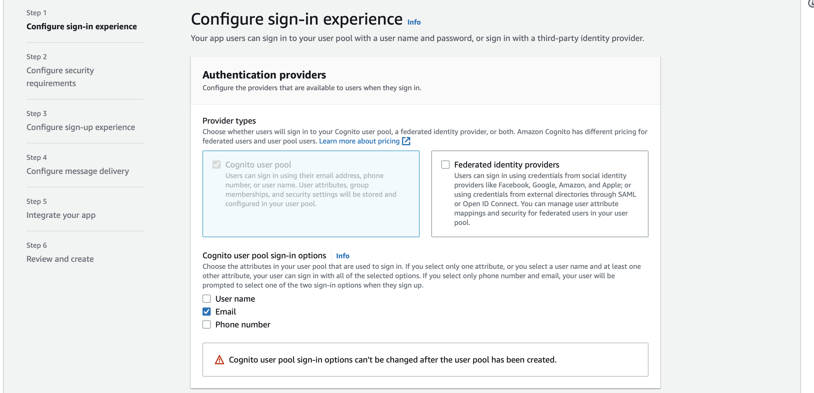

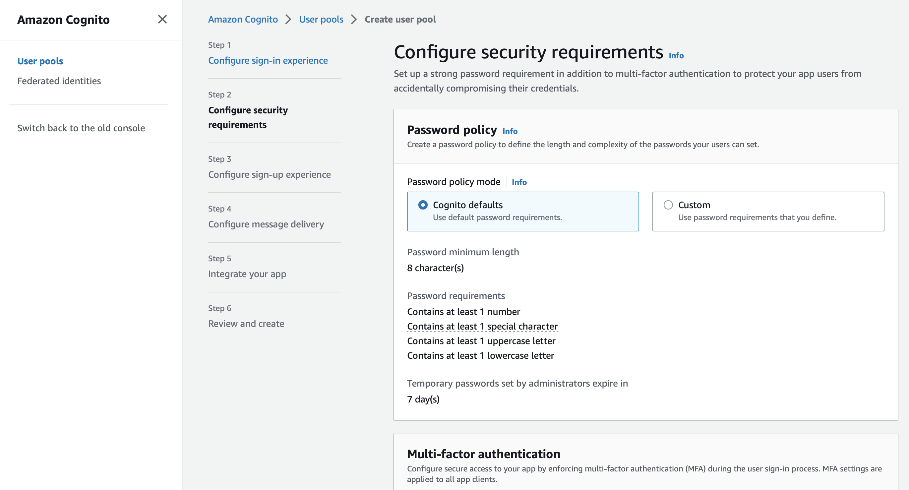

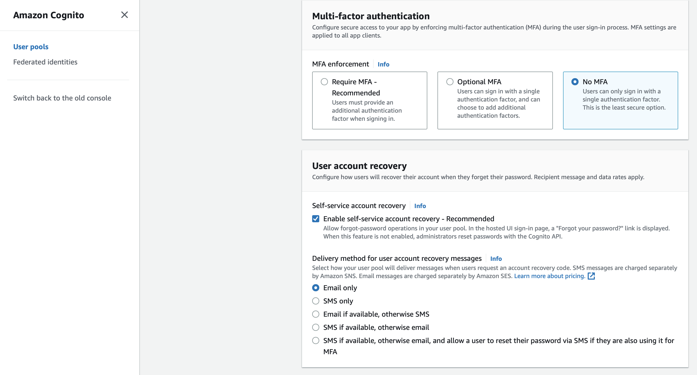

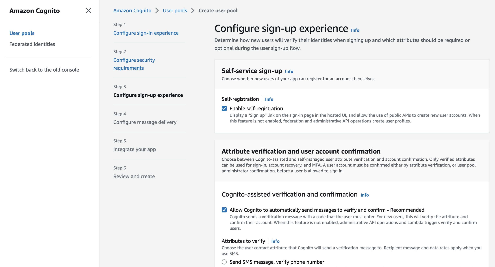

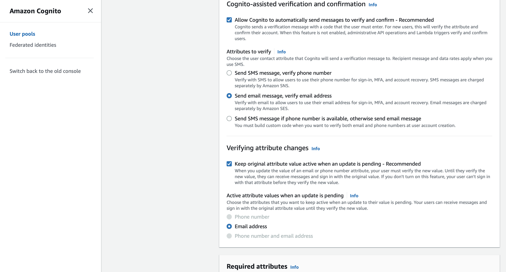

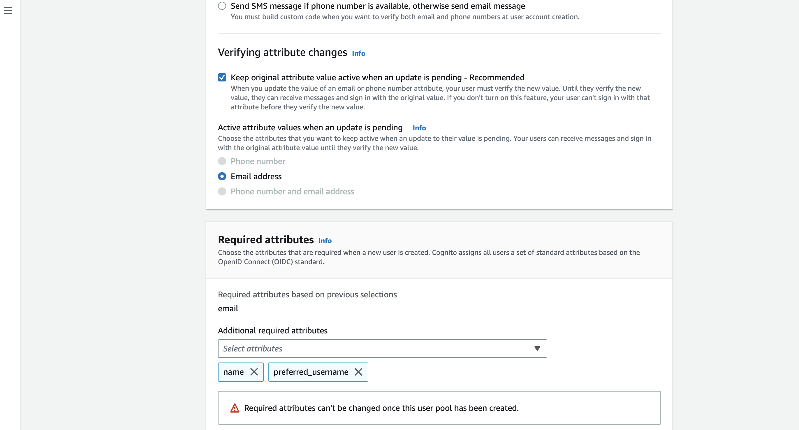

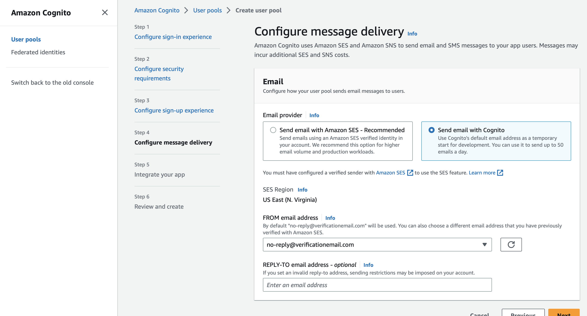

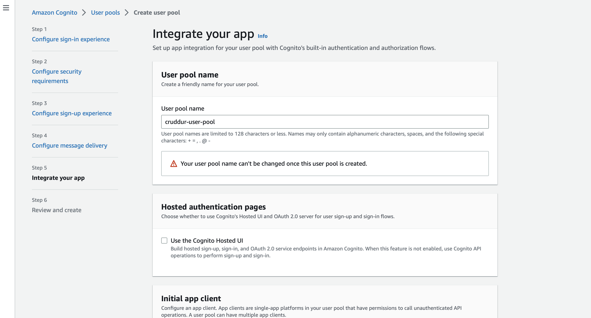

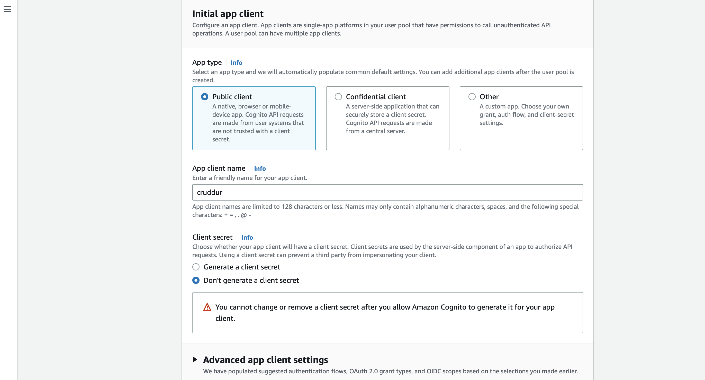

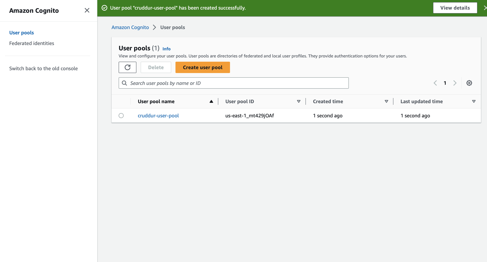


Thereafter, we'll install AWS Amplify on the client-side `frontend-react-js`

```
cd frontend-react-js
npm i aws-amplify --save
```

We then configure our cognito pool on the client-side of our app through `App.js`: 
[Commit](https://github.com/enyioman/aws-bootcamp-cruddur-2023/commit/3120511101ca5a587a7c3626dd1a925f3a222e7e)

```
import { Amplify } from 'aws-amplify';

Amplify.configure({
  "AWS_PROJECT_REGION": process.env.REACT_AWS_PROJECT_REGION,
  "aws_cognito_identity_pool_id": process.env.REACT_APP_AWS_COGNITO_IDENTITY_POOL_ID,
  "aws_cognito_region": process.env.REACT_APP_AWS_COGNITO_REGION,
  "aws_user_pools_id": process.env.REACT_APP_AWS_USER_POOLS_ID,
  "aws_user_pools_web_client_id": process.env.REACT_APP_CLIENT_ID,
  "oauth": {},
  Auth: {
    // We are not using an Identity Pool
    // identityPoolId: process.env.REACT_APP_IDENTITY_POOL_ID, // REQUIRED - Amazon Cognito Identity Pool ID
    region: process.env.REACT_AWS_PROJECT_REGION,           // REQUIRED - Amazon Cognito Region
    userPoolId: process.env.REACT_APP_AWS_USER_POOLS_ID,         // OPTIONAL - Amazon Cognito User Pool ID
    userPoolWebClientId: process.env.REACT_APP_AWS_USER_POOLS_WEB_CLIENT_ID,   // OPTIONAL - Amazon Cognito Web Client ID (26-char alphanumeric string)
  }
});
```


We'll also update the required environmental variables in our `docker-compose.yml` file.

```
REACT_APP_AWS_PROJECT_REGION: "${AWS_DEFAULT_REGION}"
REACT_APP_AWS_COGNITO_REGION: "${AWS_DEFAULT_REGION}"
REACT_APP_AWS_USER_POOLS_ID: "us-east-1_mt429jOAf"
REACT_APP_CLIENT_ID: "2jp0hhqhp6kp49rkgv70rpckfs"
```

## Implement API calls to Amazon Coginto for custom login, signup, recovery and forgot password page

### Conditionally show components based on logged in or logged out


### HomeFeedPage

We'll update `HomeFeedPage.js` with the following code:

```
import { Auth } from 'aws-amplify';

// set a state
const [user, setUser] = React.useState(null);

// check if we are authenicated
const checkAuth = async () => {
  Auth.currentAuthenticatedUser({
    // Optional, By default is false. 
    // If set to true, this call will send a 
    // request to Cognito to get the latest user data
    bypassCache: false 
  })
  .then((user) => {
    console.log('user',user);
    return Auth.currentAuthenticatedUser()
  }).then((cognito_user) => {
      setUser({
        display_name: cognito_user.attributes.name,
        handle: cognito_user.attributes.preferred_username
      })
  })
  .catch((err) => console.log(err));
};

// check when the page loads if we are authenicated
React.useEffect(()=>{
  loadData();
  checkAuth();
}, [])
```

This above code is implementing an authentication check using the AWS Amplify library. First, it imports the Auth object from aws-amplify. The function `checkAuth` is then defined as an asynchronous function that will check if the current user is authenticated with the AWS Cognito service. Within the function, `Auth.currentAuthenticatedUser()` is called with the optional parameter bypassCache set to false. This means that if the user data is cached, it will return the cached data, but if not, it will send a request to Cognito to get the latest user data. If the user is authenticated, it will log the user object to the console and then call `Auth.currentAuthenticatedUser()` again.

The `then` method is then used to extract the necessary user information from the cognito_user object and set it in the user state using the `setUser` method. If an error occurs during the authentication check, it will be caught and logged to the console.


We'll want to pass `user` to the following components:

```
<DesktopNavigation user={user} active={'home'} setPopped={setPopped} />
<DesktopSidebar user={user} />
```

### DesktopSidebar

We'll update `DesktopSidebar.js` to display `trending` and `users` when we're logged in with the following code:

```
let trending;
  let suggested;
  let join;
  if (props.user) {
    trending = <TrendingSection trendings={trendings} />
    suggested = <SuggestedUsersSection users={users} />
  } else {
    join = <JoinSection />
  }
```
This conditional rendering allows the code to display different components based on whether or not the `props.user` value is present, which we are using to implement features that are only available to authenticated users or for displaying different content to users who are logged in versus those who are not.

### DesktopNavigation

We'll rewrite `DesktopNavigation.js` so that it it conditionally shows links in the left hand column on whether you are logged in or not. Notice we are passing the user to `ProfileInfo`:

```
import './DesktopNavigation.css';
import {ReactComponent as Logo} from './svg/logo.svg';
import DesktopNavigationLink from '../components/DesktopNavigationLink';
import CrudButton from '../components/CrudButton';
import ProfileInfo from '../components/ProfileInfo';

export default function DesktopNavigation(props) {

  let button;
  let profile;
  let notificationsLink;
  let messagesLink;
  let profileLink;
  if (props.user) {
    button = <CrudButton setPopped={props.setPopped} />;
    profile = <ProfileInfo user={props.user} />;
    notificationsLink = <DesktopNavigationLink 
      url="/notifications" 
      name="Notifications" 
      handle="notifications" 
      active={props.active} />;
    messagesLink = <DesktopNavigationLink 
      url="/messages"
      name="Messages"
      handle="messages" 
      active={props.active} />
    profileLink = <DesktopNavigationLink 
      url="/@andrewbrown" 
      name="Profile"
      handle="profile"
      active={props.active} />
  }

  return (
    <nav>
      <Logo className='logo' />
      <DesktopNavigationLink url="/" 
        name="Home"
        handle="home"
        active={props.active} />
      {notificationsLink}
      {messagesLink}
      {profileLink}
      <DesktopNavigationLink url="/#" 
        name="More" 
        handle="more"
        active={props.active} />
      {button}
      {profile}
    </nav>
  );
}
```

The component conditionally renders different components based on whether or not `props.user` is `true`. The purpose of this conditional rendering is to display different components based on whether or not the user is logged in, and to pass the necessary props to those components if the user is logged in.

### ProfileInfo

We'll update our `ProfileInfo.js` with the following code:

```
import { Auth } from 'aws-amplify';

const signOut = async () => {
  try {
      await Auth.signOut({ global: true });
      window.location.href = "/"
  } catch (error) {
      console.log('error signing out: ', error);
  }
}
```

This is defining an asynchronous function called signOut that uses the Auth object from the aws-amplify library to sign out the currently authenticated user from AWS Cognito.

The `{ global: true }` property means that the user will be signed out globally rather than just on the current device.

If the sign-out is successful, the user will be redirected to the root URL of the application (i.e. the homepage).

If there is an error during the sign-out process, it will be caught in the catch block, and the error message will be logged to the console.


### Signin Page

We'll update our `SigninPage.js` with the following code:


```
import { Auth } from 'aws-amplify';

export default function SigninPage() {

  const [email, setEmail] = React.useState('');
  const [password, setPassword] = React.useState('');
  const [errors, setErrors] = React.useState('');

  const onsubmit = async (event) => {
    setErrors('')
    event.preventDefault();
    Auth.signIn(email, password)
      .then(user => {
        localStorage.setItem("access_token", user.signInUserSession.accessToken.jwtToken)
        window.location.href = "/"
      })
      .catch(error => { 
        if (error.code == 'UserNotConfirmedException') {
          window.location.href = "/confirm"
        }
        setErrors(error.message)
      });
      return false
  }

  const email_onchange = (event) => {
    setEmail(event.target.value);
  }
  const password_onchange = (event) => {
    setPassword(event.target.value);
  }

  let el_errors;
  if (errors){
    el_errors = <div className='errors'>{errors}</div>;
  }
```

We're using the above function to handle user authentication, using the `Auth` object from the `aws-amplify` library to sign in the user, store their access token in local storage, and redirect them to the homepage. If there are any errors, the user will see an error message.

### Signup Page

[Commit link](https://github.com/enyioman/aws-bootcamp-cruddur-2023/commit/381e0213d115bdd3c0f905815aec55b9621229ce)

We'll update our `SignupPage.js` with the following code:

```
import { Auth } from 'aws-amplify';

export default function SignupPage() {

  // Username is Eamil
  const [name, setName] = React.useState('');
  const [email, setEmail] = React.useState('');
  const [username, setUsername] = React.useState('');
  const [password, setPassword] = React.useState('');
  const [errors, setErrors] = React.useState('');

  const onsubmit = async (event) => {
    event.preventDefault();
    setErrors('')
    try {
        const { user } = await Auth.signUp({
          username: email,
          password: password,
          attributes: {
              name: name,
              email: email,
              preferred_username: username,
          },
          autoSignIn: { // optional - enables auto sign in after user is confirmed
              enabled: true,
          }
        });
        console.log(user);
        window.location.href = `/confirm?email=${email}`
    } catch (error) {
        console.log(error);
        setErrors(error.message)
    }
    return false
  }

  const name_onchange = (event) => {
    setName(event.target.value);
  }
  const email_onchange = (event) => {
    setEmail(event.target.value);
  }
  const username_onchange = (event) => {
    setUsername(event.target.value);
  }
  const password_onchange = (event) => {
    setPassword(event.target.value);
  }

  let el_errors;
  if (errors){
    el_errors = <div className='errors'>{errors}</div>;
  }
```

In the above, we are defining a SignupPage component which allows a user to sign up for the application. The component is importing the Auth module from aws-amplify library. The component is using React.useState hook to manage state variables. The variables being managed are 'name', 'email', 'username', 'password' and 'errors'.

The component is defining an onSubmit function to handle the form submission. The function is calling the Auth.signUp method to sign up the user. The attributes field is being used to pass name, email, and preferred username to Cognito user pool. The autoSignIn field is an optional parameter that can be used to enable auto sign-in after the user is confirmed. If an error occurs during sign-up, the error message is stored in the 'errors' variable.

Finally, the component is rendering a form with fields for name, email, username, and password. If there are any errors during sign-up, they are displayed to the user.

### Confirmation Page

[Commit link](https://github.com/enyioman/aws-bootcamp-cruddur-2023/commit/381e0213d115bdd3c0f905815aec55b9621229ce)

We'll update our `ConfirmationPage.js` with the following code:

```
const resend_code = async (event) => {
    setErrors('')
    try {
      await Auth.resendSignUp(email);
      console.log('code resent successfully');
      setCodeSent(true)
    } catch (err) {
      // does not return a code
      // does cognito always return english
      // for this to be an okay match?
      console.log(err)
      if (err.message == 'Username cannot be empty'){
        setErrors("You need to provide an email in order to send Resend Activiation Code")   
      } else if (err.message == "Username/client id combination not found."){
        setErrors("Email is invalid or cannot be found.")   
      }
    }
  }

  const onsubmit = async (event) => {
    event.preventDefault();
    setErrors('')
    try {
      await Auth.confirmSignUp(email, code);
      window.location.href = "/"
    } catch (error) {
      setErrors(error.message)
    }
    return false
  }
```

The code defines two functions, `resend_code` and `onsubmit`, which are used in a component to handle resending a confirmation code and confirming the user's email address, respectively. The resend_code function sends another confirmation code to the user's email address, while the onsubmit function confirms the user's email address using the confirmation code they received via email. If either function encounters an error, it sets the errors state variable to display the error message to the user.


### Recovery Page

[Commit link](https://github.com/enyioman/aws-bootcamp-cruddur-2023/commit/381e0213d115bdd3c0f905815aec55b9621229ce)

We'll update our `RecoveryPage.js` with the following code:

```
const onsubmit_send_code = async (event) => {
    event.preventDefault();
    setErrors('')
    Auth.forgotPassword(username)
    .then((data) => setFormState('confirm_code') )
    .catch((err) => setErrors(err.message) );
    return false
  }

  const onsubmit_confirm_code = async (event) => {
  event.preventDefault();
  setErrors('')
  if (password == passwordAgain){
    Auth.forgotPasswordSubmit(username, code, password)
    .then((data) => setFormState('success'))
    .catch((err) => setErrors(err.message) );
  } else {
    setErrors('Passwords do not match')
  }
  return false
}
```

We are using the above functions `onsubmit_send_code` and `onsubmit_confirm_code` to handle the submission of a forgot password form. The first function sends a forgot password request for the given username and sets the form state to `confirm_code` if successful, otherwise sets an error message in the errors state. The second function submits the confirmation code along with the new password entered by the user, and sets the form state to success if successful, otherwise sets an error message in the errors state. If the two passwords entered by the user do not match, an error message is set in the errors state as well.


### Creating a user in Cognito

To test out our configuration, we'll create a user in AWS Cognito.


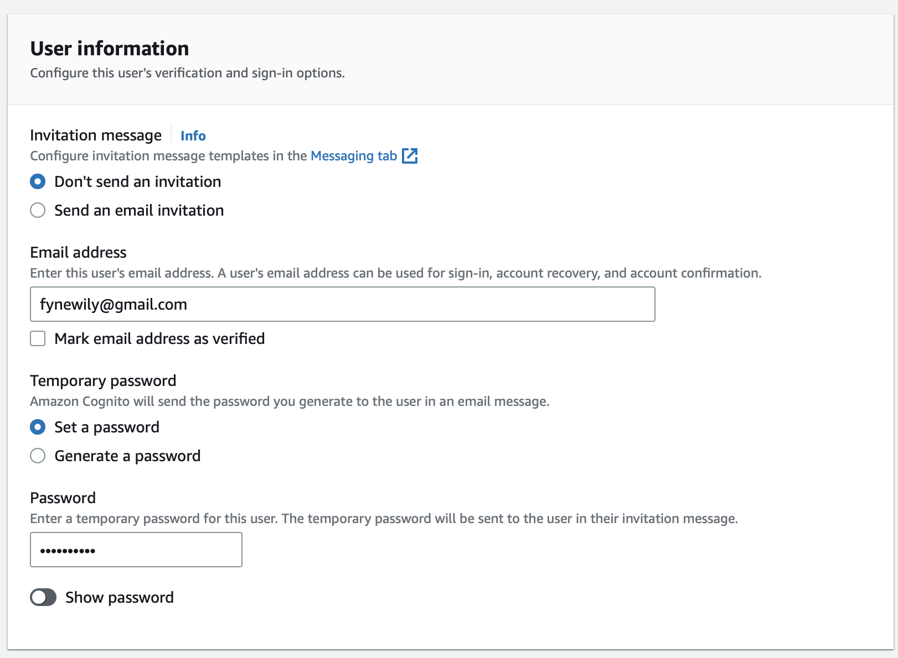

And manually verify the email with the following command:

```
aws cognito-idp admin-set-user-password \
  --user-pool-id <your-user-pool-id> \
  --username <username> \
  --password <password> \
  --permanent
```


### Adding Optional Attributes in Cognito

We'll add additional attributes like username to our user.

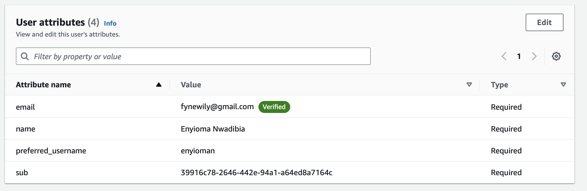


## Verify JWT Token server side to serve authenticated API endpoints in Flask Application

First add Flask Cognito dependency to the server-side via `requirements.txt`

```
Flask-AWSCognito
```

Then run:

```
pip install -r requirements.txt
```

### Passing the JWT token along to the backend

[Commit link](https://github.com/enyioman/aws-bootcamp-cruddur-2023/commit/212316fbbc6db6f3b2f60fe4fa16f50747ee56bb)

We added the following code to our `SigninPage.js`:

```
localStorage.setItem("access_token", user.signInUserSession.accessToken.jwtToken)
```

This method is used to store data in the browser's local storage, which is a key-value pair storage that persists even after the browser is closed. In this code, the access_token key is set to the value of the jwtToken property of the accessToken object within the `signInUserSession` property of the user object.

The jwtToken is a JSON Web Token (JWT) that is returned by the authentication service. It contains information about the user and is used to authenticate subsequent requests to the server. By storing the jwtToken in the localStorage, the token can be retrieved and sent with each request to the server to authenticate the user.

To pass the JWT to backend, in `HomeFeedPage.js` we are updating the const res with Authorization header:

```
const res = await fetch(backend_url, {
        headers: {
          Authorization: `Bearer ${localStorage.getItem("access_token")}`
        },
```

We'll configure Cognito in `app.py`:

```
from lib.cognito_jwt_token import CognitoJwtToken, extract_access_token, TokenVerifyError

cognito_jwt_token = CognitoJwtToken(
  user_pool_id=os.getenv("AWS_COGNITO_USER_POOL_ID"), 
  user_pool_client_id=os.getenv("AWS_COGNITO_USER_POOL_CLIENT_ID"),
  region=os.getenv("AWS_DEFAULT_REGION")
)

@app.route("/api/activities/home", methods=['GET'])
@xray_recorder.capture('activities_home')
def data_home():
  access_token = extract_access_token(request.headers)
  try:
    claims = cognito_jwt_token.verify(access_token)
    # authenicatied request
    app.logger.debug("authenicated")
    app.logger.debug(claims)
    app.logger.debug(claims['username'])
    data = HomeActivities.run(cognito_user_id=claims['username'])
  except TokenVerifyError as e:
    # unauthenicatied request
    app.logger.debug(e)
    app.logger.debug("unauthenicated")
    data = HomeActivities.run()
  return data, 200
```

Then we'll modify our CORS config in `app.py` also:

```
cors = CORS(
  app, 
  resources={r"/api/*": {"origins": origins}},
  headers=['Content-Type', 'Authorization'], 
  expose_headers='Authorization',
  methods="OPTIONS,GET,HEAD,POST"
)
```

`/backend-flask/lib/cognito_jwt_token.py` for the token validation:

```
import time
import requests
from jose import jwk, jwt
from jose.exceptions import JOSEError
from jose.utils import base64url_decode

class FlaskAWSCognitoError(Exception):
  pass

class TokenVerifyError(Exception):
  pass

def extract_access_token(request_headers):
    access_token = None
    auth_header = request_headers.get("Authorization")
    if auth_header and " " in auth_header:
        _, access_token = auth_header.split()
    return access_token

class CognitoJwtToken:
    def __init__(self, user_pool_id, user_pool_client_id, region, request_client=None):
        self.region = region
        if not self.region:
            raise FlaskAWSCognitoError("No AWS region provided")
        self.user_pool_id = user_pool_id
        self.user_pool_client_id = user_pool_client_id
        self.claims = None
        if not request_client:
            self.request_client = requests.get
        else:
            self.request_client = request_client
        self._load_jwk_keys()


    def _load_jwk_keys(self):
        keys_url = f"https://cognito-idp.{self.region}.amazonaws.com/{self.user_pool_id}/.well-known/jwks.json"
        try:
            response = self.request_client(keys_url)
            self.jwk_keys = response.json()["keys"]
        except requests.exceptions.RequestException as e:
            raise FlaskAWSCognitoError(str(e)) from e

    @staticmethod
    def _extract_headers(token):
        try:
            headers = jwt.get_unverified_headers(token)
            return headers
        except JOSEError as e:
            raise TokenVerifyError(str(e)) from e

    def _find_pkey(self, headers):
        kid = headers["kid"]
        # search for the kid in the downloaded public keys
        key_index = -1
        for i in range(len(self.jwk_keys)):
            if kid == self.jwk_keys[i]["kid"]:
                key_index = i
                break
        if key_index == -1:
            raise TokenVerifyError("Public key not found in jwks.json")
        return self.jwk_keys[key_index]

    @staticmethod
    def _verify_signature(token, pkey_data):
        try:
            # construct the public key
            public_key = jwk.construct(pkey_data)
        except JOSEError as e:
            raise TokenVerifyError(str(e)) from e
        # get the last two sections of the token,
        # message and signature (encoded in base64)
        message, encoded_signature = str(token).rsplit(".", 1)
        # decode the signature
        decoded_signature = base64url_decode(encoded_signature.encode("utf-8"))
        # verify the signature
        if not public_key.verify(message.encode("utf8"), decoded_signature):
            raise TokenVerifyError("Signature verification failed")

    @staticmethod
    def _extract_claims(token):
        try:
            claims = jwt.get_unverified_claims(token)
            return claims
        except JOSEError as e:
            raise TokenVerifyError(str(e)) from e

    @staticmethod
    def _check_expiration(claims, current_time):
        if not current_time:
            current_time = time.time()
        if current_time > claims["exp"]:
            raise TokenVerifyError("Token is expired")  # probably another exception

    def _check_audience(self, claims):
        # and the Audience  (use claims['client_id'] if verifying an access token)
        audience = claims["aud"] if "aud" in claims else claims["client_id"]
        if audience != self.user_pool_client_id:
            raise TokenVerifyError("Token was not issued for this audience")

    def verify(self, token, current_time=None):
        """ https://github.com/awslabs/aws-support-tools/blob/master/Cognito/decode-verify-jwt/decode-verify-jwt.py """
        if not token:
            raise TokenVerifyError("No token provided")

        headers = self._extract_headers(token)
        pkey_data = self._find_pkey(headers)
        self._verify_signature(token, pkey_data)

        claims = self._extract_claims(token)
        self._check_expiration(claims, current_time)
        self._check_audience(claims)

        self.claims = claims 
        return claims
```

The class CognitoJwtToken is for verifying JWTs issued by Amazon Cognito user pools. The class takes in the user_pool_id, user_pool_client_id, and region as inputs. It uses the requests library to download a set of JSON Web Key (JWK) public keys from Cognito's endpoint, which it uses to verify the signature of the JWT.

The class has several private methods that handle the extraction of JWT headers and claims, as well as the verification of the token's signature, expiration, and audience.

The verify method is the public interface for verifying a token. It takes in a token and an optional current_time parameter, which can be used to set a custom current time for verifying the token's expiration.

If the token verification succeeds, the method returns the token's claims as a dictionary and sets the class's claims attribute to the same dictionary.

We also defined two custom exceptions, FlaskAWSCognitoError and TokenVerifyError, which are used for handling errors related to the AWS Cognito user pool and token verification, respectively.

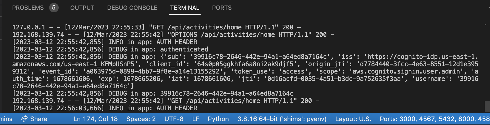