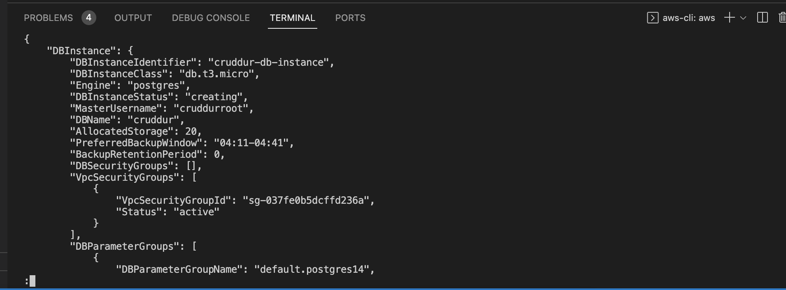
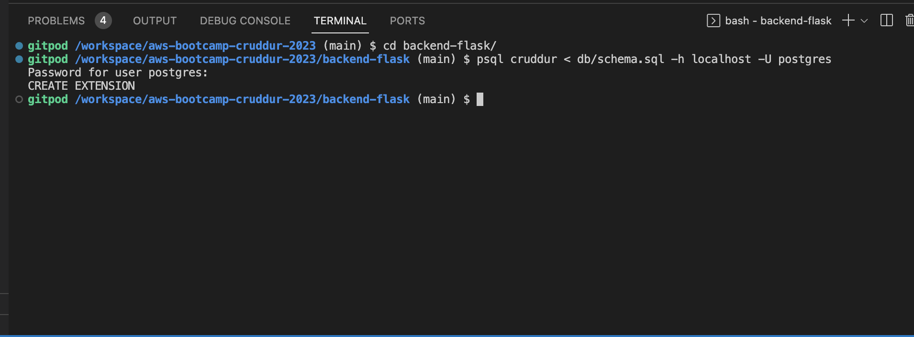
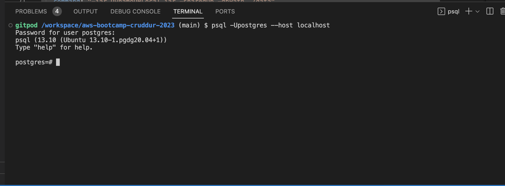
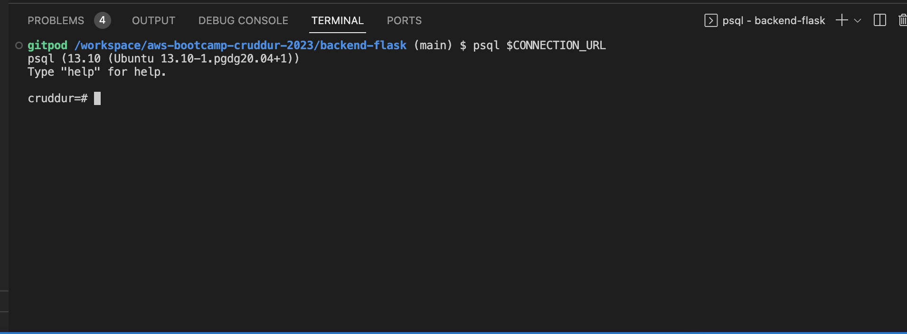
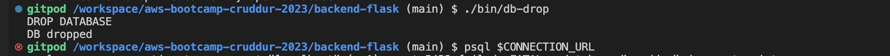
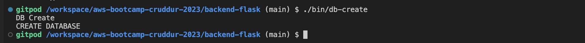

# Week 4 — Postgres and RDS

PostgreSQL is a powerful open source relational database management system (RDBMS) known for its robustness, performance, and support for a wide range of features, including ACID compliance, transactions, indexes, and advanced SQL queries. It is widely used by developers and enterprises for building and deploying high-performance, scalable, and reliable applications.

Amazon RDS (Relational Database Service) is a cloud-based database service provided by Amazon Web Services (AWS) that makes it easy to deploy, operate, and scale a relational database in the cloud. RDS supports several database engines, including PostgreSQL, MySQL, Oracle, and SQL Server.

When using PostgreSQL on RDS, you can take advantage of several benefits, including automated backups, automatic software patching, and high availability through Multi-AZ deployments. Additionally, RDS provides features such as monitoring, alarms, and security management, making it easier for developers to focus on building applications instead of managing infrastructure.

In summary, PostgreSQL is a powerful database management system, and RDS is a cloud-based database service that provides PostgreSQL as a managed service. Using RDS can make it easier to deploy and manage PostgreSQL databases in the cloud, while taking advantage of AWS's scalability and reliability features.


In a bid to have our Cruddur app post and get data to/from the database, we will carry out the following tasks.

## Provision an RDS instance

We'll provision our RDS through AWS CLI using the below command:

```
aws rds create-db-instance \
  --db-instance-identifier cruddur-db-instance \
  --db-instance-class db.t3.micro \
  --engine postgres \
  --engine-version  14.6 \
  --master-username <username> \
  --master-user-password <password> \
  --allocated-storage 20 \
  --availability-zone us-east-1a \
  --backup-retention-period 0 \
  --port 5432 \
  --no-multi-az \
  --db-name cruddur \
  --storage-type gp2 \
  --publicly-accessible \
  --storage-encrypted \
  --enable-performance-insights \
  --performance-insights-retention-period 7 \
  --no-deletion-protection
```




We'll stop the RDS instance temporarily afterwards to save cost. Note that the RDS instance will automatically restart after 7 days.

Then headover to our `docker-compose.yml` file to make sure we have Postgres container image configuration of our localhost.


### Add UUID Extension 

UUIDs are 128-bit unique identifiers that can be used as primary keys in databases, as well as for other purposes such as generating unique session IDs or tracking unique objects in a distributed system. The uuid-ossp extension provides several functions for generating UUIDs including uuid-ossp.uuid_generate_v1, uuid-ossp.uuid_generate_v3, uuid-ossp.uuid_generate_v4, and uuid-ossp.uuid_generate_v5. Each of these functions generates a UUID using a different algorithm.

We'll make a new `db` folder and file `schema.sql`: `/backend-flask/db/schema.sql`.

We'll add the extension with the below commands:

```
CREATE EXTENSION "uuid-ossp";
CREATE EXTENSION IF NOT EXISTS "uuid-ossp";
```





Run the container and log into it to validate the creation of our `cruddur` database.





Let's get acquainted with some common postgresql commands:

```sql
\x on -- expanded display when looking at data
\q -- Quit PSQL
\l -- List all databases
\c database_name -- Connect to a specific database
\dt -- List all tables in the current database
\d table_name -- Describe a specific table
\du -- List all users and their roles
\dn -- List all schemas in the current database
CREATE DATABASE database_name; -- Create a new database
DROP DATABASE database_name; -- Delete a database
CREATE TABLE table_name (column1 datatype1, column2 datatype2, ...); -- Create a new table
DROP TABLE table_name; -- Delete a table
SELECT column1, column2, ... FROM table_name WHERE condition; -- Select data from a table
INSERT INTO table_name (column1, column2, ...) VALUES (value1, value2, ...); -- Insert data into a table
UPDATE table_name SET column1 = value1, column2 = value2, ... WHERE condition; -- Update data in a table
DELETE FROM table_name WHERE condition; -- Delete data from a table
```


We'll make a URL Connection String to simplify our login process to our DB. We'll create it as an environmental variable and persist same on Gitpod:

```sh
postgresql://[user[:password]@][netloc][:port][/dbname][?param1=value1&...]

eg:
cd backend-flask
export CONNECTION_URL="postgresql://<username>:<password>@localhost:5432/cruddur"
gp env CONNECTION_URL="postgresql://<username>:<password>@localhost:5432/cruddur"
```

To login to the database, use:

```
psql $CONNECTION_URL
```




Then set another one for the production RDS instance:

```
export PROD_CONNECTION_URL="postgresql://<username>:<password>@<RDS endpoint>:5432/cruddur"

gp env PROD_CONNECTION_URL="postgresql://<username>:<password>@<RDS endpoint>:5432/cruddur"
```

## Write several bash scripts for database operations

We'll automate repetitive database operations with bash scripts. We'll create a folder `bin` and files `db-create`, `db-drop`, and `db-schema-load`, then make the files executable.

### Files and Contents
`db-drop`

```sh
#! /usr/bin/bash

CYAN='\033[1;36m'
NO_COLOR='\033[0m'
LABEL="DB Drop"
printf "${CYAN}== ${LABEL}${NO_COLOR}\n"

NO_DB_CONNECTION_URL=$(sed 's/\/cruddur//g' <<< "$CONNECTION_URL")

psql $NO_DB_CONNECTION_URL -c "DROP DATABASE cruddur;"
```

In the above script, we first formatted the terminal output some texts with a certain colour. We're also using the `sed` command to remove the "/cruddur" part from the CONNECTION_URL string, since the original URL included the name of the database ("cruddur") as part of the connection string. The resulting string is then used as an argument to the psql command to drop the "cruddur" database.





`db-create`

```sh
#! /usr/bin/bash

CYAN='\033[1;36m'
NO_COLOR='\033[0m'
LABEL="DB Create"
printf "${CYAN}== ${LABEL}${NO_COLOR}\n"

NO_DB_CONNECTION_URL=$(sed 's/\/cruddur//g' <<< "$CONNECTION_URL")

psql $NO_DB_CONNECTION_URL -c "CREATE DATABASE cruddur;"
```



`db-schema-load`

```sh
#! /usr/bin/bash

CYAN='\033[1;36m'
NO_COLOR='\033[0m'
LABEL="DB Schema Load"
printf "${CYAN}== ${LABEL}${NO_COLOR}\n"

SCHEMA_PATH=$(realpath .)/db/schema.sql

echo $SCHEMA_PATH

if [ "$1" = "prod" ]; then
  echo "Running in production mode"
  CON_URL=$PROD_CONNECTION_URL
else
  echo "Running in development mode"
  CON_URL=$CONNECTION_URL
fi

psql $CON_URL cruddur < $SCHEMA_PATH
```

In the above script we are first saving the absolute path of the file `schema.sql` in the directory `db` relative to the current working directory to the env vars `SCHEMA_PATH`. We will load the schema to the production database if the input is `prod` and to development database if it's not.

### Create our tables

Let's create tables for our `cruddur` database. Add these commands to `schema.sql` file.

`users table`
```sql
CREATE TABLE public.users (
  uuid UUID DEFAULT uuid_generate_v4() PRIMARY KEY,
  display_name text,
  handle text
  cognito_user_id text,
  created_at TIMESTAMP default current_timestamp NOT NULL
);
```

`activities table`

```sql
CREATE TABLE public.activities (
  uuid UUID DEFAULT uuid_generate_v4() PRIMARY KEY,
  message text NOT NULL,
  replies_count integer DEFAULT 0,
  reposts_count integer DEFAULT 0,
  likes_count integer DEFAULT 0,
  reply_to_activity_uuid integer,
  expires_at TIMESTAMP,
  created_at TIMESTAMP default current_timestamp NOT NULL
);
```

`db-connect`

```sh
#! /usr/bin/bash

if [ "$1" = "prod" ]; then
  echo "Running in production mode"
  CON_URL=$PROD_CONNECTION_URL
else
  CON_URL=$CONNECTION_URL
fi

psql $CON_URL
```

`db-seed`

```sh
#! /usr/bin/bash

CYAN='\033[1;36m'
NO_COLOR='\033[0m'
LABEL="DB Seed Load"
printf "${CYAN}== ${LABEL}${NO_COLOR}\n"

SEED_PATH=$(realpath .)/db/seed.sql

echo $SEED_PATH

if [ "$1" = "prod" ]; then
  echo "Running in production mode"
  CON_URL=$PROD_CONNECTION_URL
else
  echo "Running in development mode"
  CON_URL=$CONNECTION_URL
fi

psql $CON_URL cruddur < $SEED_PATH
```

We'll go ahead and create a file `backend-flask/db/sql/seed.sql` for the seed data. Then proceed to seed the data into our database.


```sql
INSERT INTO public.users (display_name, handle, cognito_user_id)
VALUES
  ('Andrew Brown', 'andrewbrown' ,'MOCK'),
  ('Andrew Bayko', 'bayko' ,'MOCK');

INSERT INTO public.activities (user_uuid, message, expires_at)
VALUES
  (
    (SELECT uuid from public.users WHERE users.handle = 'andrewbrown' LIMIT 1),
    'This was imported as seed data!',
    current_timestamp + interval '10 days'
  )
```


